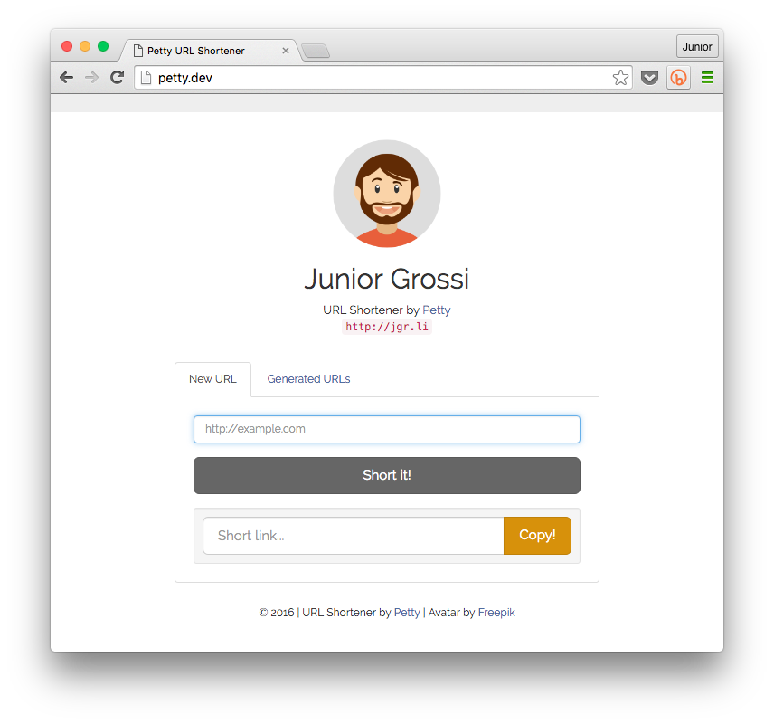

# Petty URL Shortener

> Have your own URL shortener, using your own domain, with easy.




Petty is a small PHP app (made with Laravel) that allows you to host your own URL shortener. It's clean and easy to use and install, allowing you to have your own shortener in a few minutes. 

For now it does not support statistics, that is made initially by Bitly. We're working on new features and in the future Petty will do all the job. Please, contribute with the project and suggest new features.

## How it works

Petty shorts the original URL generating new URLs like `http://doma.in/m9`. This URL redirects to a Bitly shorten URL (where, if you want, you can get more statistics) and after to the original URL.

The app uses **your own domain**, and the generated URLs are customized for you. All generated URL are stored in a Sqlite database and generated using your Laravel `APP_KEY`, so using `http://doma.in/m9` as example, the `m9` is generated only for you, and represents a row stored in your local database. The generated hash (`m9`) has at least 2 chars length.

## Installing

The easier and recommended way to install Petty is using the `create-project` command in Composer:

```
composer create-project --prefer-dist jgrossi/petty my-shortener
```

You can also clone this repo and run `composer install` to get all PHP dependencies, but this way you have to generate Laravel application key `php artisan key:generate` by hand. The recommended installation is using `create-project` that does everything Petty needs to run.

After Petty installed you have only to run your webserver in the `/public` folder and access the URL. Petty will have everything working, including database.

Attention! Your web root (virtual host) will be `my-shortener/public`!

## Usage

As Petty for now does not provide more statistics (only clicks) every short URL has your Bitly correspondent. So before use your own URL shortener you should create a free [Bitly](http://bitly.com) account and set your `username` and `password` to the `.env` file. More information in the *Configuration* section below.

## Configuration

All configuration is made using `.env`. You'll have a `.env.sample` that was copied to the `.env` file when you've installed Petty. You have to customize this file with your personal data, URL, name, avatar image, and Bitly username and password.

```
APP_ENV=local # Your app env
APP_DEBUG=true # Enabe or disable debug?
APP_KEY=8gboHDJkh2q80dRPFcy6y0X5PsaUVcKa # This key is generated when you install Petty

DB_CONNECTION=sqlite
DB_FILE="database.sqlite" # You can change this if you want

CACHE_DRIVER=file # Laravel default
SESSION_DRIVER=file # Laravel default
QUEUE_DRIVER=sync # Laravel default

# The domain you want to use, like http://doma.in
PETTY_DOMAIN="http://petty.dev"

# Minimum number of chars, like http://doma.in/m8 - the number 1 won't work
PETTY_SIZE=2 

# Your avatar image. By default we have set 2 avatars: `avatar-male.png` and `avatar-female.png` - Tranks to http://www.freepik.com. You can store your own image in `public` directory and link that, like `img/your-custom-avatar.png`;
PETTY_AVATAR="img/avatar-male.png"

# Your own name, like "Junior Grossi"
PETTY_NAME="Your Name" 

# Your Bitly username. If you don't have one just signup and get yours for free
PETTY_USERNAME="jgrossi" 

# Your Bitly password
PETTY_PASSWORD=secret  
```

### Running your own assets

By default all `css` and `js` files are stored in `public` folder minified and merged. If you want to customize your assets files, like changing `css` or even `js` I suggest to install `bower` packages and `elixir (gulp)`. This will take a little:

```
bower install
npm install
```

Bower will install Bootstrap, Clipboard.js, FontAwesome, jQuery and jQuery-UJS (by Ruby on Rails). NPM will install gulp and all Elixir dependencies. 

After that you will have 3 more directories in your folder root: `vendor` (PHP packages by Composer), `bower_components` (packages by Bower) and `node_modules` (packages by Node JS). The original `css` and `js` files are stored in `resources/assets` folder.

Running `gulp watch --production` will allow you to change the `resources/assets/css/*.less` and `resources/assets/js/*.js` files. So, after that `gulp` will merge everything and minify the result, storing them in `public/css/styles.css` and `public/js/scripts.js`, respectively.

You can also change and customize the views (HTML), change colors, etc. Bee free to make Petty like you want.

## Contributing

Thank you for considering contributing to the Petty URL Shortener! Just made your changes, suggest and create a pull request to the `dev` branch. Any question just ask in `issues` section. Any help or suggestion is welcome!

Petty has much to grow. This is the first release and that's the minimum to a URL shortener works. So, please send features suggestions, statistics suggestions and what you think will be good to the package.

## Licence

[MIT License](http://jgrossi.mit-license.org/) © Junior Grossi
